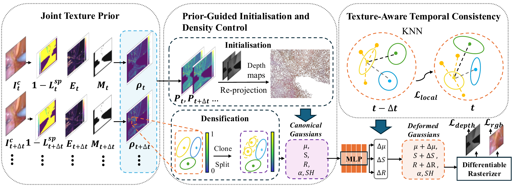

# EndoPrior-GS

Official implementation of **EndoPrior-GS: Dynamic Endoscopic Reconstruction with a Joint Texture Prior**, accepted at ACCV 2026.

[](assets/overview.pdf)

[View the pipeline as a PDF](assets/overview.pdf).

## Installation

Requires Linux, an NVIDIA GPU, a CUDA 12.x toolkit (`nvcc`) and a compatible C++ compiler. Our setup uses Python 3.10, PyTorch 2.5.1 with CUDA 12.1, and GCC 12.

Run from the repository root:

```bash
conda env create -f environment.yml
conda activate endoprior-gs
export CC=gcc-12 CXX=g++-12
python -m pip install --no-build-isolation --no-deps submodules/depth-diff-gaussian-rasterization
python -m pip install --no-build-isolation --no-deps submodules/simple-knn
```

The extension sources are included in this repository. Adjust the compiler names if your CUDA-compatible compiler is installed elsewhere.

## Data preparation

Download [EndoNeRF](https://github.com/med-air/EndoNeRF), [SCARED](https://endovissub2019-scared.grand-challenge.org/) or [StereoMIS](https://zenodo.org/records/8154924), and organise the sequences as follows:

```text
data/
├── endonerf/
│   ├── pulling/
│   └── cutting/
├── scared/
│   ├── dataset_1/keyframe_1/
│   ├── dataset_2/keyframe_1/
│   ├── dataset_3/keyframe_1/
│   ├── dataset_6/keyframe_1/
│   └── dataset_7/keyframe_1/
└── stereomis/
    ├── P2_7/
    └── P2_8/
```

**EndoNeRF:** use the prepared sequences containing `images/`, `depth/`, `masks/` and `poses_bounds.npy`. No additional conversion is needed.

**SCARED:** use the prepared keyframes and run `train.py` directly.

**StereoMIS:** use the prepared P2_7 and P2_8 sequences containing `images/`, `depth/`, `masks/`, `poses_bounds.npy` and `split.json`, then run `train.py` directly.

## Training

All datasets use `train.py`. The default presets run 1,000 coarse iterations and 3,000 fine iterations.

```bash
# EndoNeRF
python train.py --config endoprior-endonerf -s data/endonerf/pulling --expname endonerf/pulling
python train.py --config endoprior-endonerf -s data/endonerf/cutting --expname endonerf/cutting

# SCARED: change dataset_1 and d1k1 for datasets 2, 3, 6 and 7.
python train.py --config endoprior-scared -s data/scared/dataset_1/keyframe_1 --expname scared/d1k1

# StereoMIS
python train.py --config endoprior-stereomis -s data/stereomis/P2_7 --expname stereomis/P2_7
python train.py --config endoprior-stereomis -s data/stereomis/P2_8 --expname stereomis/P2_8
```

Use a new `--expname` for each run. The final model (`point_cloud.ply` and `deformation.pth`), `run_config.json` and TensorBoard logs are saved under `output/<expname>/`.

```bash
tensorboard --logdir output
```

Hyperparameters and ablations are available through `python train.py --help`, including `--disable_prior_initialisation`, `--disable_prior_density_control`, `--disable_prior_temporal_regularisation` and `--disable_prior_temporal_weighting`.

## Rendering

Rendering automatically reads the saved configuration:

```bash
python render.py --model_path output/endonerf/pulling --skip_train
python render.py --model_path output/scared/d1k1 --skip_train
python render.py --model_path output/stereomis/P2_7 --skip_train
```

Use the corresponding output path for the other sequences. Test images are saved in `test/ours_3000/renders/`. Add `--reconstruct` to export reconstructed point clouds, or `-s /new/data/path` if the dataset has moved.

FPS is measured after 10 warm-up renders over 10 repeated passes, excluding data loading, CPU transfer and file saving. Images and videos are exported once.

## Evaluation

```bash
python metrics.py --model_paths output/endonerf/pulling
python metrics.py --model_paths output/scared/d1k1
python metrics.py --model_paths output/stereomis/P2_7
```

Results are saved to `results.json` and `per_view.json`. Metrics include PSNR, SSIM, LPIPS, FLIP, depth RMSE and Flow Error; the video split supplies depth temporal instability. Keep video rendering enabled for that metric. Pretrained evaluation weights are downloaded on first use.

The StereoMIS comparison table uses a separate uniform evaluation protocol; these commands run the repository's standard evaluator.

## Acknowledgements

We thank [EndoGaussian](https://github.com/CUHK-AIM-Group/EndoGaussian), [3D Gaussian Splatting](https://github.com/graphdeco-inria/gaussian-splatting), [4DGaussians](https://github.com/hustvl/4DGaussians) and [K-Planes](https://github.com/sarafridov/K-Planes) for their released code.

## Licence

See [LICENSE.md](LICENSE.md).
